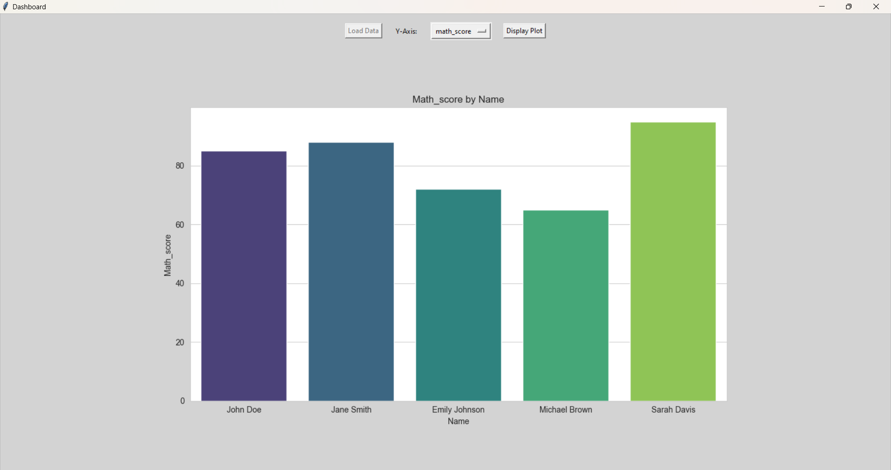

<h1>Student Performance Dashboard</h1>

The Student Performance Dashboard is a Python-based application designed to visualize and analyze student data. This project reads student performance metrics from CSV or JSON files and presents insights through interactive and informative visualizations.

<h2>Key Features</h2>

Import student data from CSV/JSON formats.

Visualize metrics name by score using graphs and charts powered by Matplotlib and Seaborn.

